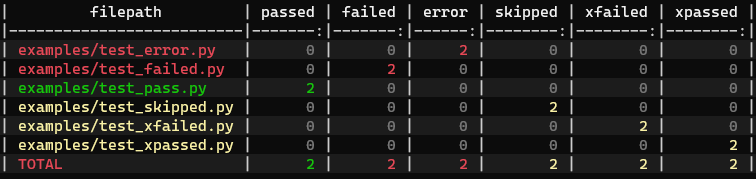

.. contents:: **pytest-md-report**
   :backlinks: top
   :depth: 2

Summary
============================================
.. image:: https://badge.fury.io/py/pytest-md-report.svg
    :target: https://badge.fury.io/py/pytest-md-report
    :alt: PyPI package version

.. image:: https://img.shields.io/pypi/pyversions/pytest-md-report.svg
    :target: https://pypi.org/project/pytest-md-report
    :alt: Supported Python versions

.. image:: https://img.shields.io/pypi/implementation/pytest-md-report.svg
    :target: https://pypi.org/project/pytest-md-report
    :alt: Supported Python implementations

.. image:: https://img.shields.io/travis/thombashi/pytest-md-report/master.svg?label=Linux/macOS%20CI
    :target: https://travis-ci.org/thombashi/pytest-md-report
    :alt: Linux/macOS CI status

.. image:: https://img.shields.io/appveyor/ci/thombashi/pytest-md-report/master.svg?label=Windows%20CI
    :target: https://ci.appveyor.com/project/thombashi/pytest-md-report/branch/master
    :alt: Windows CI status

A pytest plugin to make a test results report with Markdown table format.

Installation
============================================
::

    pip install pytest-md-report

Usage
============================================
::

    $ pytest --md-report examples/

    Output example

Increase verbosity level:

::

    $ pytest -v --md-report examples/

.. figure:: ss/pytest_md_report_example_verbose.png
    :scale: 80%
    :alt: output_example_verbose

    Output example (verbose)

Options
============================================

Command options
--------------------------------------------
::

    make test results report with markdown table format:
      --md-report           create markdown report. you can also specify the value
                            with PYTEST_MD_REPORT environment variable.
      --md-report-verbose=VERBOSITY_LEVEL
                            verbosity level for pytest-md-report. if not set, using
                            verbosity level of pytest. defaults to 0. you can also
                            specify the value with PYTEST_MD_REPORT_VERBOSE
                            environment variable.
      --md-report-color={auto,text,never}
                            auto: display colored (text and background) reports by
                            using ANSI escape codes. text: display colored (text)
                            reports by using ANSI escape codes. never: diplay report
                            without color. defaults to 'auto'. you can also specify
                            the value with PYTEST_MD_REPORT_COLOR environment
                            variable.

ini-options
--------------------------------------------
[pytest] ini-options in the first pytest.ini|tox.ini|setup.cfg file found:

::

  md_report (bool):     create markdown report.
  md_report_verbose (string):
                        verbosity level for pytest-md-report. if not set, using
                        verbosity level of pytest. defaults to 0.
  md_report_color (string):
                        auto: display colored (text and background) reports by
                        using ANSI escape codes. text: display colored (text)
                        reports by using ANSI escape codes. never: diplay report
                        without color. defaults to 'auto'.

Example of ``setup.cfg``:

::

    [tool:pytest]
    md_report = True
    md_report_verbose = 0
    md_report_color = auto

Dependencies
============================================
Python 3.5+

- `pytablewriter <https://github.com/thombashi/pytablewriter>`__
- `pytest <https://docs.pytest.org/en/latest/>`__
- `typepy <https://github.com/thombashi/typepy>`__
